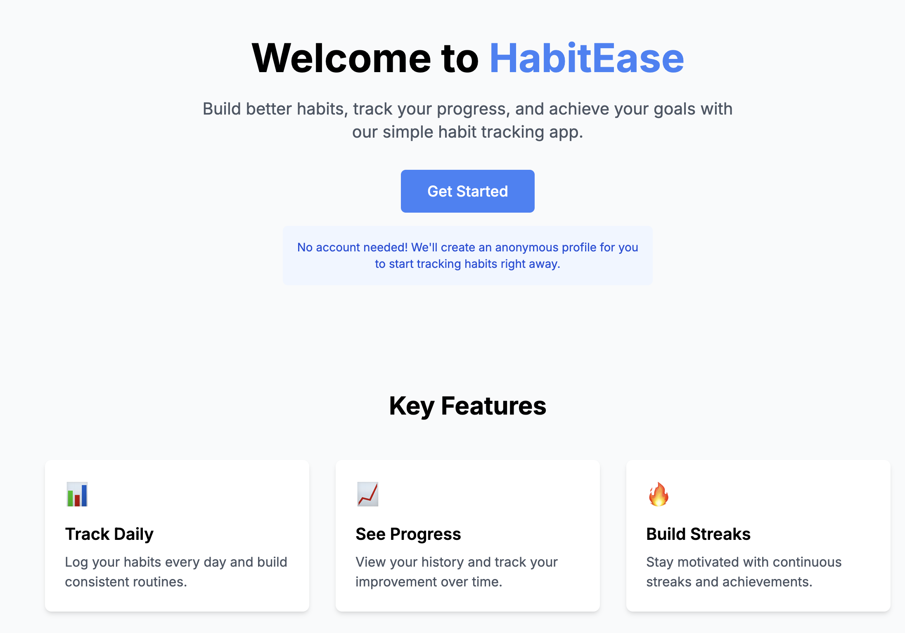

# HabitEase - Habit Tracking Application

A full-stack habit tracking application that helps users build better habits through consistent tracking and meaningful visualizations.



## Overview

HabitEase is a feature-rich habit tracking application designed to help users build productive routines, break bad habits, and visualize their progress over time. The application allows users to track daily habits, view completion patterns, and gain insights into their behavior.

### Key Features

-   📊 **Daily Habit Logging**: Easily log your daily habits with just a few clicks
-   📈 **Progress Visualization**: Track your consistency with heatmaps and charts
-   🔥 **Streak Building**: Stay motivated with streak tracking
-   📱 **Clean, Minimalist UI**: Simple interface focuses on what matters
-   📅 **Calendar View**: See which days you've completed your habits
-   🔍 **Pattern Recognition**: Identify trends in your habit completion

## Technology Stack

### Frontend (Client)

-   Next.js 15.2.0
-   React 19.0.0
-   TailwindCSS for styling
-   Chart.js for data visualization

### Backend (Server)

-   Express.js
-   MongoDB for data storage
-   JWT for authentication

## Getting Started

### Prerequisites

-   Node.js (v18 or higher)
-   MongoDB
-   npm or yarn

### MongoDB Installation

You can install MongoDB using Docker by following these steps:

1. Ensure Docker is running on your machine
2. Pull the MongoDB Docker image:

```bash
docker pull mongodb/mongodb-community-server:latest
```

3. Run the image as a container:

```bash
docker run --name mongodb-p 27017:27017 -d mongodb/mongodb-community-server:latest
```

4. Check that the container is running:

```bash
docker container ls
```

5. Connect to MongoDB using mongosh:

```bash
mongosh
```

or

```bash
mongosh --port 27017
```

See the MongoDB documentation for more detailed installation instructions for different operating systems.

### Installation

1. Clone the repository:

```bash
git clone https://github.com/yourusername/habitease.git
cd habitease
```

2. Set up the server:

```bash
cd server
npm install
```

3. Create a `.env` file in the server directory with:

```bash
PORT=8000
MONGO_URL=mongodb://localhost:27017/habitease
JWT_SECRET=your_secret_key_here
```

4. Set up the client:

```bash
cd ../client
npm install
```

5. Create a `.env.local` file in the client directory with:

```bash
NEXT_PUBLIC_API_URL=http://localhost:8000/api
```

### Running the Application

1. Starting the MongoDB server (if not using Docker)

2. Start the backend server

```bash
cd server
npm run dev
```

3. Start the frontend client:

```bash
cd client
npm run dev
```

4. Open the browser and navigate to `http://localhost:3000`

### Creating a New Habit

1. Click on "Add Habit" from the dashboard
2. Enter a habit name, select an icon, and optionally add a unit of measurement
3. Click "Create Habit"

### Logging a Habit

1. From the dashboard, click "+" on the habit card
2. If the habit has a unit (like pages or minutes), enter the value
3. Click "Complete Habit"

### Viewing Habit Details

1. Click on any habit card to see detailed statistics
2. View heatmaps, weekly patterns, and monthly trends
3. See your completion history and streaks

### Editing or Deleting Habits

1. Navigate to the habit detail page
2. Use the "Edit" button to modify habit details
3. Use the "Delete" button to remove a habit

```bash
habitease/
├── client/                 # Frontend Next.js application
│   ├── app/                # Next.js app directory
│   │   ├── components/     # React components
│   │   ├── context/        # React context (Auth)
│   │   ├── dashboard/      # Dashboard page
│   │   ├── habits/         # Habit pages (new, details, edit)
│   │   └── lib/            # Utility functions and API client
│   └── public/             # Static assets
│
└── server/                 # Backend Express.js application
├── src/
│   ├── controllers/    # Route handlers
│   ├── middleware/     # Express middleware
│   ├── models/         # MongoDB schemas
│   ├── routes/         # API routes
│   └── scripts/        # DB initialization scripts
└── app.js              # Express application

```

## Acknowledgments

-   This project was created as a take-home assignment to showcase frontend and backend development skills.
-   Special thanks to the open-source libraries and tools that made this project possible.
